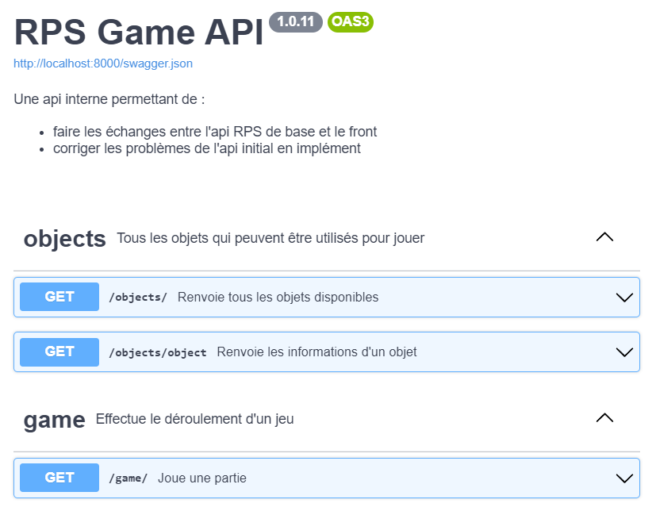

# API

Vous trouverez sur cette page la liste des routes API présentes dans RPS-Game.

(c'est une image car le build dynamique ne fonctionne que en local. Le fichier swagger est disponible sur le lien `API description file`)

